# 🤖 PDF Knowledge Bot


<div align="center">


**Transform any PDF into an interactive AI tutor that answers your questions instantly**

[🚀 Quick Start](#-quick-start) • [✨ Features](#-features) • [🎯 Demo](#-demo) • [📚 Documentation](#-documentation)


</div>

---

## 🌟 What Makes This Special?

Ever wished you could have a conversation with your PDFs? **PDF Knowledge Bot** turns any document into an intelligent assistant that understands context, remembers details, and provides accurate answers with precise source citations.

### 🎭 Perfect For:
- 📖 **Students** - Study smarter, not harder
- 🔬 **Researchers** - Extract insights from papers instantly  
- 💼 **Professionals** - Navigate complex documents with ease
- 📚 **Educators** - Create interactive learning experiences

---

## ✨ Features

### 🧠 **Intelligent Document Processing**
- **Smart Text Extraction** - Advanced PDF parsing with page tracking
- **Semantic Chunking** - Intelligent text segmentation with context preservation
- **Vector Embeddings** - High-quality OpenAI embeddings for semantic search

### 💬 **Interactive Q&A Experience**
- **Natural Language Queries** - Ask questions like you're talking to a human
- **Context-Aware Answers** - Responses that understand document relationships
- **Source Citations** - Every answer includes precise page references
- **Confidence Scoring** - Know how reliable each answer is

### 🎯 **Smart Study Tools**
- **Auto-Generated Questions** - AI creates study questions from your content
- **Question Suggestions** - Get inspired with relevant queries
- **Chat History** - Track your learning journey
- **Multiple Question Types** - Factual, analytical, and application-based

### 🔍 **Advanced Search & Retrieval**
- **FAISS Vector Search** - Lightning-fast similarity matching
- **Relevance Ranking** - Best matches appear first
- **Multi-chunk Context** - Comprehensive answers from multiple sources

---

## 🚀 Quick Start

### Prerequisites
```bash
Python 3.8+
OpenAI API Key (get one at https://platform.openai.com/)
```

### 1️⃣ Clone & Install
```bash
git clone https://github.com/yourusername/pdf-knowledge-bot.git
cd pdf-knowledge-bot
pip install -r requirements.txt
```

### 2️⃣ Launch the App
```bash
python app.py
```

### 3️⃣ Start Learning!
1. 🔑 **Enter your OpenAI API key**
2. 📄 **Upload your PDF**
3. ⏳ **Wait for processing** (usually 30-60 seconds)
4. 💬 **Ask away!**

```
🌐 App running at: http://localhost:8000
```

---

## 🎯 Demo

### Sample Interactions

**📖 Academic Paper**
```
Q: "What methodology did the authors use for data collection?"
A: The authors employed a mixed-methods approach combining surveys (n=500) and semi-structured interviews (n=25) as described on page 8. The survey used a 5-point Likert scale to measure...

Sources: Page 8, 12 (Similarity: 0.89)
```

**📊 Business Report**
```
Q: "What were the key financial metrics for Q3?"
A: Q3 showed strong performance with revenue of $2.4M (18% increase YoY) and EBITDA of $650K as reported on page 15. The growth was primarily driven by...

Sources: Page 15, 16 (Similarity: 0.92)
```

**🎓 Textbook Chapter**
```
Q: "Can you explain photosynthesis in simple terms?"
A: Based on the content from pages 45-47, photosynthesis is essentially how plants make food using sunlight. The process involves chlorophyll capturing light energy to convert...

Sources: Page 45, 46, 47 (Similarity: 0.85)
```

---

## 🛠️ Installation & Setup

### Option 1: Simple Setup
```bash
# Clone the repository
git clone https://github.com/yourusername/pdf-knowledge-bot.git
cd pdf-knowledge-bot

# Install dependencies
pip install -r requirements.txt

# Run the application
python app.py
```

### Option 2: Virtual Environment (Recommended)
```bash
# Create virtual environment
python -m venv pdf-bot-env

# Activate it
# Windows:
pdf-bot-env\Scripts\activate
# macOS/Linux:
source pdf-bot-env/bin/activate

# Install dependencies
pip install -r requirements.txt

# Run the application
python app.py
```

### Option 3: Docker (Coming Soon)
```bash
docker build -t pdf-knowledge-bot .
docker run -p 8000:8000 pdf-knowledge-bot
```

---

## 📋 Requirements

### Core Dependencies
```
fasthtml>=0.2.0
openai>=1.0.0
PyPDF2>=3.0.0
numpy>=1.21.0
pandas>=1.3.0
faiss-cpu>=1.7.0
nltk>=3.8
tiktoken>=0.4.0
starlette>=0.20.0
uvicorn>=0.18.0
```

### System Requirements
- **Memory**: 4GB+ RAM recommended
- **Storage**: 1GB+ free space
- **Internet**: Required for OpenAI API calls

---

## 🎨 How It Works

### 🔄 The Magic Behind the Scenes

```mermaid
graph TD
    A[📄 Upload PDF] --> B[🔍 Extract Text]
    B --> C[✂️ Smart Chunking]
    C --> D[🧠 Generate Embeddings]
    D --> E[📊 Build Vector Index]
    E --> F[❓ User Question]
    F --> G[🔍 Similarity Search]
    G --> H[🤖 Generate Answer]
    H --> I[📝 Return with Sources]
```



### 🧩 Architecture Components

1. **📄 PDF Parser** - Extracts text while preserving page structure
2. **✂️ Text Chunker** - Intelligent segmentation with overlap for context
3. **🧠 Embedding Engine** - OpenAI's text-embedding-3-small for semantic understanding
4. **🔍 Vector Database** - FAISS for efficient similarity search
5. **🤖 Answer Generator** - GPT-4 for comprehensive, contextual responses

---

## 🎯 Use Cases & Examples

### 📚 **Academic Research**
- Analyze research papers and extract key findings
- Compare methodologies across multiple studies
- Generate literature review summaries

### 💼 **Business Intelligence**
- Extract insights from financial reports
- Analyze market research documents
- Review contracts and legal documents

### 🎓 **Education & Learning**
- Create study guides from textbooks
- Generate quiz questions automatically
- Facilitate interactive learning sessions

### 📖 **Content Analysis**
- Summarize long-form content
- Extract specific information quickly
- Cross-reference multiple documents

---

## ⚙️ Configuration

### Environment Variables
```bash
# Optional: Set default API key
export OPENAI_API_KEY="your-api-key-here"

# Optional: Customize settings
export MAX_CHUNK_SIZE=500
export CHUNK_OVERLAP=50
export MAX_SEARCH_RESULTS=5
```

### Customization Options

**Adjust chunk size for different document types:**
```python
# For dense academic papers
max_tokens=300, overlap_tokens=30

# For general documents  
max_tokens=500, overlap_tokens=50

# For technical manuals
max_tokens=800, overlap_tokens=100
```

---

## 🚀 Advanced Features

### 🎯 **Question Generation**
Automatically creates study questions based on document content:
- **Factual Questions** - Test knowledge retention
- **Analytical Questions** - Encourage critical thinking  
- **Application Questions** - Connect theory to practice

### 📊 **Confidence Scoring**
Each answer includes a confidence score based on:
- Semantic similarity to source content
- Number of supporting sources
- Consistency across retrieved chunks

### 🔍 **Smart Search**
Advanced retrieval system featuring:
- **Hybrid Search** - Combines semantic and keyword matching
- **Context Preservation** - Maintains document relationships
- **Relevance Ranking** - Best matches surface first

---

## 🛡️ Privacy & Security

### 🔒 **Data Handling**
- **No Storage** - Documents are processed in memory only
- **API Security** - Your OpenAI key never leaves your environment
- **Session-Based** - No persistent data storage

### 🌐 **API Usage**
- Uses OpenAI's `text-embedding-3-small` for embeddings
- Uses `gpt-4o-mini` for answer generation
- Optimized for cost-effective operation

---

## 🤝 Contributing

We love contributions! Here's how to get started:

### 🐛 **Bug Reports**
Found a bug? Please include:
- PDF type and size
- Error message (if any)
- Steps to reproduce

### ✨ **Feature Requests**
Ideas for improvements:
- New document formats
- Additional AI models
- UI/UX enhancements

### 💻 **Development Setup**
```bash
# Fork the repository
git fork https://github.com/yourusername/pdf-knowledge-bot.git

# Create feature branch
git checkout -b feature/amazing-feature

# Make your changes
# ...

# Submit pull request
git push origin feature/amazing-feature
```

---

## 📊 Performance & Limits

### ⚡ **Processing Speed**
- **Small PDFs** (<10 pages): ~30 seconds
- **Medium PDFs** (10-50 pages): ~1-2 minutes  
- **Large PDFs** (50+ pages): ~3-5 minutes

### 📏 **Size Limits**
- **Maximum file size**: 50MB
- **Maximum pages**: 200 pages
- **Optimal range**: 5-50 pages

### 💰 **Cost Estimation**
Typical costs per document:
- **Embeddings**: $0.01-0.10 per document
- **Q&A**: $0.001-0.01 per question
- **Total**: Usually under $0.20 per document

---

## 🔧 Troubleshooting

### Common Issues & Solutions

**❌ "No text could be extracted"**
- Try a different PDF (some are image-only)
- Ensure PDF isn't password protected
- Check file isn't corrupted

**❌ "API key error"**
- Verify your OpenAI API key is valid
- Check you have sufficient credits
- Ensure key has embedding permissions

**❌ "Processing timeout"**
- Large PDFs may take several minutes
- Check your internet connection
- Try with a smaller document first

**❌ "Memory error"**
- Close other applications
- Try processing smaller sections
- Restart the application

---

## 📈 Roadmap

### 🎯 **Coming Soon**
- [ ] 📊 **Multiple file formats** (Word, PowerPoint, HTML)
- [ ] 🌍 **Multi-language support**  
- [ ] 📱 **Mobile-responsive design**
- [ ] 💾 **Document library management**
- [ ] 🔄 **Batch processing**

### 🚀 **Future Vision**
- [ ] 🧠 **Multiple AI model support** (Claude, Gemini)
- [ ] 📊 **Advanced analytics dashboard**
- [ ] 🤝 **Collaborative features**
- [ ] 🔌 **API endpoints**
- [ ] 🎨 **Custom theming**

---

## 📄 License

This project is licensed under the MIT License - see the [LICENSE](LICENSE) file for details.

```
MIT License - Feel free to use, modify, and distribute!
```

---

## 🙏 Acknowledgments

### 🎉 **Built With Amazing Tools**
- **[FastHTML](https://fastht.ml/)** - Modern Python web framework
- **[OpenAI](https://openai.com/)** - GPT models and embeddings
- **[FAISS](https://faiss.ai/)** - Efficient similarity search
- **[PyPDF2](https://pypdf2.readthedocs.io/)** - PDF processing
- **[NLTK](https://www.nltk.org/)** - Natural language processing

### 💝 **Special Thanks**
- OpenAI team for incredible AI models
- FastHTML community for the amazing framework
- All contributors and testers

---

## 📞 Support & Community

### 💬 **Get Help**
- 🐛 **Issues**: [GitHub Issues](https://github.com/yourusername/pdf-knowledge-bot/issues)
- 💡 **Discussions**: [GitHub Discussions](https://github.com/yourusername/pdf-knowledge-bot/discussions)
- 📧 **Email**: support@pdfknowledgebot.com

### 🌟 **Show Your Support**
If this project helped you, please:
- ⭐ **Star the repository**
- 🍴 **Fork and contribute**
- 📢 **Share with others**
- ☕ **Buy us a coffee** (coming soon!)

---

<div align="center">

**Made with ❤️ for the learning community**

[⬆️ Back to Top](#-pdf-knowledge-bot)

</div>
